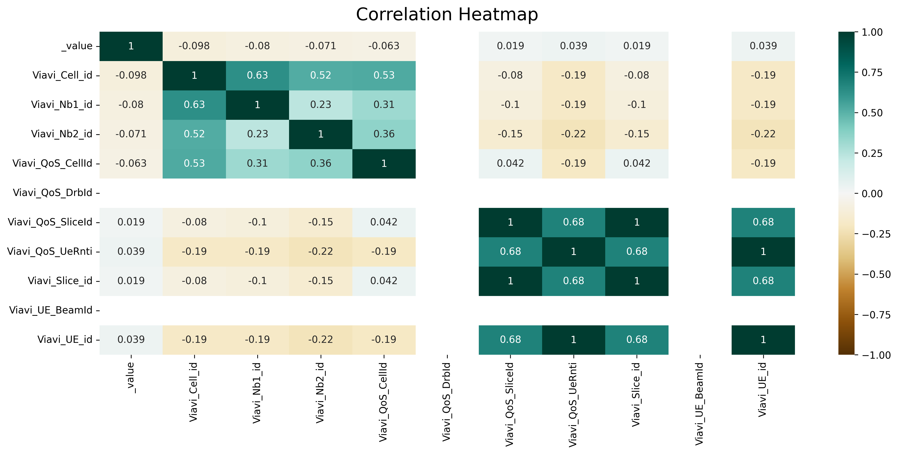

# TRAFFIC PREDICTION xAPP

## Data Cleansing
There file in `src/RIC_Influx_Data_Cleansing.ipynb` purpose to analysis the existence RIC data on InfluxDB. It explains to trace the data for creating the proper model to traffic prediction.

The data from InfluxDB was messy. Thus it should be clean it first. This data are complex, thus it will separate into two models. The first model is coming out from the ID and the second one for forecasting. As seen at the picture above, it's ID while the data are fetch by KPIMON to InfluxDB. 