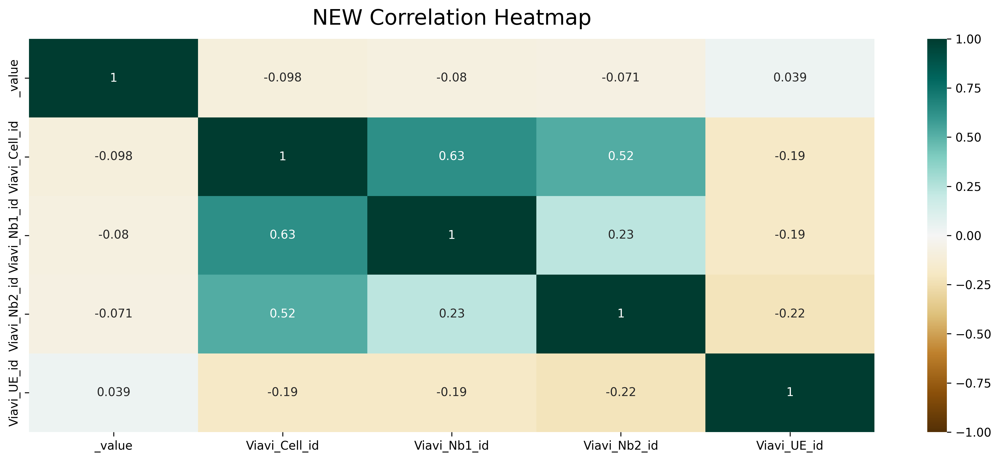
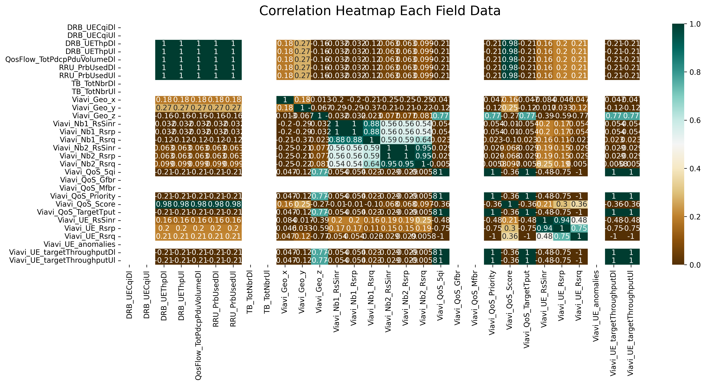
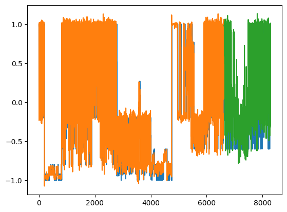
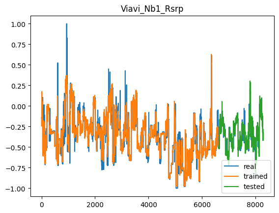
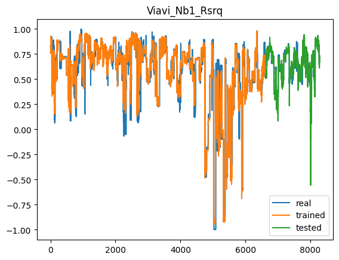
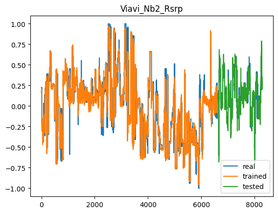
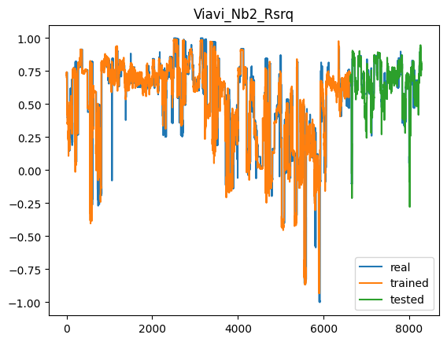
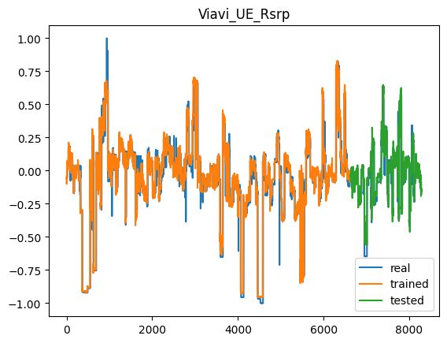
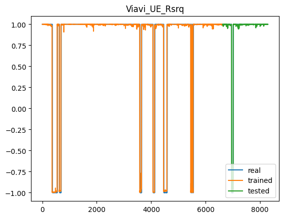

# TRAFFIC PREDICTION xAPP


## InfluxDB connected
### Fetch Data Manual in InfluxDB
To fetch manually just login into InfluxDB either localhost or cloud. In here using static IP localhost from BMW Lab. After login go to explore. There are many option to do in explore section. 

Here we take the UE metrics data and cell metrics data.


**UE Metrics Data**
248,584 Data


**Cell Metrics Data**
27,350 Data


### Connect InfluxDB in Python
This is the experiment of connecting BMW Lab's Influx DB using python. Firstly, install the influxDB either in python or linux system (localhost database if want to).
```bash
sudo apt install influxdb influxdb-client python3-influxdb
```
After that create python file, the code is in `/src/database.py`

The token and url are confidental. Don't expose it when push the gituhub. Instead, using such a environment variable to hide that variable.

There's an empty array because the database is currently off (see in figure above on the result of first terminal).


## Data Cleansing and Learning
There file in `src/RIC_Influx_Data_Cleansing.ipynb` purpose to analysis the existence RIC data on InfluxDB. It explains to trace the data for creating the proper model to traffic prediction.


The data from InfluxDB is messy. Thus, it should be clean it first. This data are complex, i will separate into two models. The first model is coming out from the ID and the second one for forecasting. As seen at the picture above, it's ID while the data are fetch by KPIMON to InfluxDB. There are a lot of ID that correlation and blank. The correlation each other means that if we remove or drop the data, it doesn't affect nothing and blank means the data doesn't affect also. Therefore, we can drop and remove it the data into the following picture below.



The first system is already clear, now the second one which for prediction of traffic. The goals of the traffic is to enhance the system by predict the traffic. The system enhances the eMMB, MMTC, and uRLLC. 
* Ultra-Reliable and Low Latency Communications (uRLLC). Ultra-reliable means reliability of up to 99.999%; low latency means latency in low single-digit milliseconds. 
* Enhanced Mobile Broadband (eMBB). The eMBB concept focuses on speed, capacity and mobility for new mobile uses such as high-definition video streaming and immersive augmented reality (AR) and virtual reality (VR) on the go.
* Massive Machine-Type Communications (mMTC). mMTC means connecting large numbers of devices in a given area—up to 1 million devices per square kilometer—that have low data rate requirements and low energy consumption.
Therefore we dig deeper into the related data to 3 main goals. Before doing that, we can also do the correlation matrix in the UE data.


The picture above shown that there are a lot of feature that should be dropped. We drop or remove the data from 30 to 7.

## Model 

The chosen of these 7 feature are relate to 3 main goals has been talking before. There is the explanation
* DRB UE (Data Radio Bearer User Equipment) Throughput refers to the data transfer rate achieved by the user equipment (UE) through a specific Data Radio Bearer (DRB) in a cellular network.
* Neighbour RSRP (Reference Signal Received Power) refers to the received power level of the reference signal from neighboring cells in a cellular network. RSRP is a measurement used to assess the signal strength of neighboring base stations or cells.
* Neighbour RSRQ (Reference Signal Received Quality) is a measurement used in cellular networks to assess the quality of the received signals from neighboring cells. RSRQ takes into account both the received power level (RSRP) and the level of interference and noise in the network.
* UE RSRP (User Equipment Reference Signal Received Power) refers to the received power level of the reference signal at the user equipment (UE) in a cellular network. RSRP is a measurement used to assess the strength of the signal received by the UE from the serving cell or neighboring cells.
* UE RSRQ (User Equipment Reference Signal Received Quality) is a measurement used in cellular networks to assess the quality of the received signal at the user equipment (UE). RSRQ takes into account both the received power level (RSRP) and the level of interference and noise in the network.

## Model Algorithm
### Q-Learning Algorithm
Q-learning is a type of reinforcement learning, which is a machine learning approach that trains machines to learn from positive and negative reinforcement, similar to how we train dogs or children. In reinforcement learning, an agent learns to make decisions by interacting with an environment. Q-learning specifically focuses on finding the best action to take in a given state to maximize the reward.

The goal of Q-learning is to find the optimal policy for decision-making. The agent starts with no knowledge of the environment and randomly chooses actions. It then receives feedback in the form of rewards from the environment. If the action leads to a positive outcome, the agent is rewarded, and if it leads to a negative outcome, the agent is penalized. Over time, the agent learns to associate actions with states and their corresponding rewards.

Q-learning uses a Q-table to store the expected cumulative rewards for each state-action pair. The Q-values in the table are initially set to zero. As the agent interacts with the environment and receives rewards, it updates the Q-values based on the observed rewards and the maximum Q-value of the next state. This iterative process continues until the agent learns the optimal policy.

The Q-learning algorithm uses the Bellman equation to update the Q-values. This equation calculates the new Q-value based on the immediate reward and the discounted maximum Q-value of the next state. By updating the Q-values iteratively, the agent learns to make better decisions over time, gradually converging towards the optimal policy. The Bellman states that the optimal Q-value of a state-action pair is equal to the immediate reward plus the discounted maximum Q-value of the next state-action pair. The algorithm iteratively updates the Q-values using the following formula:

$Q(s, a) = Q(s, a) + α * (R(s, a) + γ * max(Q(s', a')) - Q(s, a))$

Where:

$Q(s, a)$ represents the Q-value of taking action 'a' in state 's'.
$α (alpha)$ is the learning rate, determining the impact of new information on the existing Q-values.
$R(s, a)$ is the immediate reward obtained after taking action 'a' in state 's'.
$γ (gamma)$ is the discount factor, balancing the importance of immediate and future rewards.
$s'$ is the next state reached after taking action 'a' in state 's'.
$a'$ is the optimal action to take in state 's'.

### LSTM
LSTM stands for Long Short-Term Memory, and it is a type of recurrent neural network (RNN) architecture commonly used in the field of Deep Learning. LSTM is specifically designed to address the challenge of capturing long-term dependencies in sequential data, making it well-suited for tasks involving sequence prediction.

Unlike traditional neural networks, LSTM incorporates feedback connections, enabling it to process entire sequences of data rather than just individual data points. This makes it highly effective in understanding and predicting patterns in sequential data such as time series, text, and speech.

The key feature of LSTM is its ability to learn and retain information for long periods, hence the term "Long Short-Term Memory." It achieves this by using gating mechanisms to control the flow of information within the recurrent computations. These gates regulate the memory storage and retrieval processes, allowing the network to selectively store or release information as needed.

The architecture of LSTM includes various components such as the input gate, forget gate, output gate, and memory cell. These components work together to control the flow of information and manage the memory storage and retrieval processes. The input gate determines how much new information should be stored in the memory, the forget gate decides which information to discard from the memory, and the output gate determines how much information should be output from the memory cell.

LSTM has gained significant popularity and has become a powerful tool in the fields of artificial intelligence and deep learning. It has been successfully applied in various domains, including speech recognition, machine translation, sentiment analysis, and time series forecasting. Its ability to capture long-term dependencies and process sequential data makes it a valuable tool for understanding and extracting insights from complex and dynamic datasets.

The LSTM unit consists of a cell state, input gate, forget gate, and output gate. These gates control the flow of information through the cell state, allowing the LSTM to retain or forget information as needed. The formulas for LSTM can be defined as follows:

Input gate ($i_t$):
$i_t = sigmoid(W_i * [h_(t-1), x_t] + b_i)$

Forget gate ($f_t$):
$f_t = sigmoid(W_f * [h_(t-1), x_t] + b_f)$

Cell state update ($g_t$):
$g_t = tanh(W_g * [h_(t-1), x_t] + b_g)$

Output gate ($o_t$):
$o_t = sigmoid(W_o * [h_(t-1), x_t] + b_o)$

Cell state update ($C_t$):
$C_t = f_t * C_(t-1) + i_t * g_t$

Hidden state ($h_t$):
$h_t = o_t * tanh(C_t)$

Where:

$x_t$ is the input at time step t.
$h_(t-1)$ is the previous hidden state.
$i_t$, $f_t$, $o_t$ are the input, forget, and output gate activations, respectively.
$g_t$ is the cell state update.
$C_t$ is the updated cell state.
$h_t$ is the current hidden state.

## The Result of LSTM






